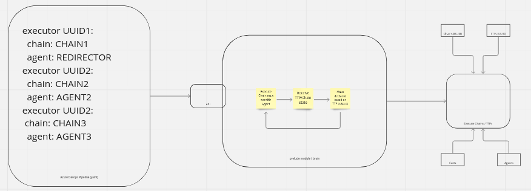

# Prelude Scenario Orchestration 

## Goals
### Min. Viable Product
 - (Prelude plugin) Automate chain execution across agents that have checked in with Prelude given a set of chain:agent pairs.
    - (gRPC server) imports scenario object sent by client.
 - (gRPC client) loads scenario YAML and sends to server.

### Extended
 - Auto-pilot functionality (No YAML just specify redirector).

## Event System

### Resources

#### prelude resources

- Event spying: prelude_eventspy.js
- Event System: https://github.com/preludeorg/community/blob/master/plugins/Sliver/Sliver.js   

#### gRPC resources

- https://pkg.go.dev/google.golang.org/protobuf

### 

